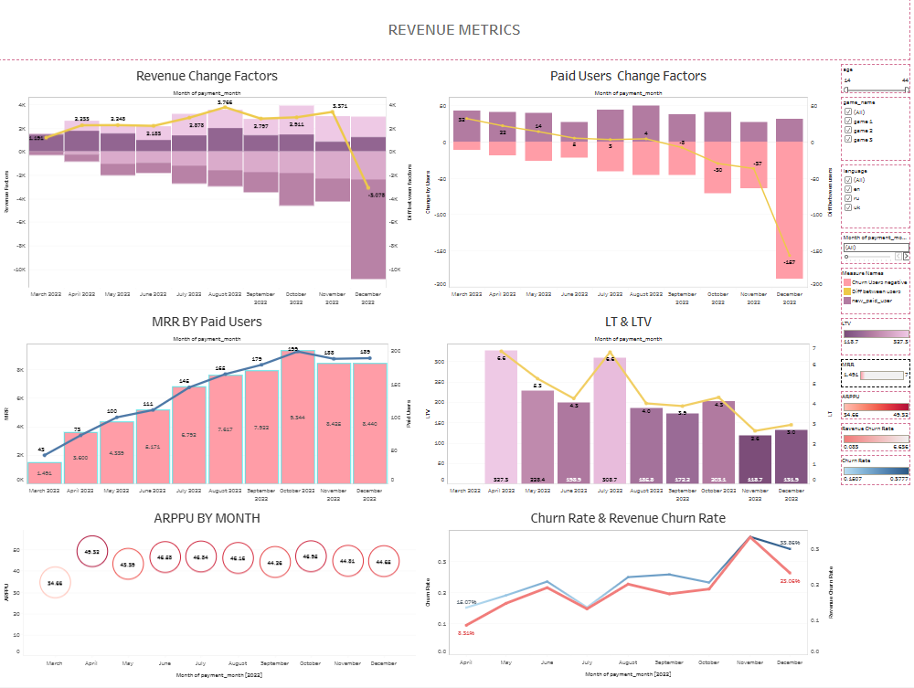

# Revenue Metrics

## 📊 Project Overview

This project focuses on analyzing revenue and customer payment behavior for a gaming product.

The analysis was performed using **PostgreSQL and SQL**, with the results presented in an interactive **Tableau dashboard**.

The project covers key revenue, customer value, and churn metrics to provide a comprehensive view of business performance.

## 🎯 Business Objectives

The main objectives of the analysis were to:

* analyze revenue dynamics over time;
* evaluate the number of paid users;
* calculate and analyze MRR and ARPPU;
* evaluate customer Lifetime and LTV;
* measure customer and revenue churn;
* identify factors influencing changes in revenue and paid users.

## 🛠️ Tools & Technologies

* **PostgreSQL** — database and data source
* **SQL** — data analysis and metric calculations
* **Tableau** — interactive data visualization and dashboard development

## 📈 Tableau Dashboard

The final analysis is presented in an interactive Tableau dashboard.



🔗 **[View the interactive dashboard on Tableau Public](https://public.tableau.com/views/RevenueMetricsProject_17722624375950/REVENUEMETRICS)**

The dashboard includes six analytical views:

* **Revenue Change Factors**
* **Paid Users Change Factors**
* **MRR by Paid Users**
* **LT & LTV**
* **ARPPU by Month**
* **Churn Rate & Revenue Churn Rate**

Interactive filters allow the analysis to be segmented by customer characteristics such as **date, language, age**, and other available attributes.

## 📌 Key Business Metrics

| Metric                 | Description                                      |
| ---------------------- | ------------------------------------------------ |
| **MRR**                | Monthly Recurring Revenue                        |
| **Paid Users**         | Number of users who made payments                |
| **ARPPU**              | Average Revenue Per Paying User                  |
| **LT**                 | Customer Lifetime                                |
| **LTV**                | Customer Lifetime Value                          |
| **Churn Rate**         | Percentage of customers who stopped paying       |
| **Revenue Churn Rate** | Percentage of revenue lost due to customer churn |

## 🔎 Key Insights

The analysis of a full year of revenue and customer payment activity revealed several key patterns:

- **Revenue:** Revenue declined as losses from existing customers and churn exceeded revenue generated from new customers.
- **Paid Users:** The paying customer base decreased, with customer outflow exceeding new user acquisition.
- **MRR:** MRR showed positive dynamics among the remaining paying users, suggesting increased revenue generated by active customers.
- **LT & LTV:** Customer Lifetime and LTV declined toward the end of the analyzed period, highlighting retention challenges.
- **ARPPU:** ARPPU remained relatively stable at approximately **$8.50–$9.10**, indicating that the main issue was the decreasing number of paying users rather than a significant drop in average spending.
- **Churn:** Customer and revenue churn increased during several periods, contributing to the overall revenue decline.

### 💡 Overall Insight

The main business challenge identified by the analysis is **customer retention**. While monetization among existing paying users remained relatively stable, the decline in paid users, Lifetime, and LTV combined with increasing churn negatively affected overall revenue.

## 🗄️ SQL Analysis

The project includes a SQL script used to prepare and calculate the metrics required for the dashboard.

The SQL analysis covers:

* data aggregation;
* revenue analysis;
* paid user analysis;
* monthly metric calculations;
* customer lifetime analysis;
* LTV calculation;
* churn analysis;
* revenue churn analysis.

The complete SQL script is available in:

`revenue_metrics.sql`

## 🔄 Analytical Workflow

```text
PostgreSQL
    ↓
SQL Analysis & Metric Calculation
    ↓
Tableau
    ↓
Interactive Revenue Metrics Dashboard
```

## 📁 Repository Structure

```text
Revenue-Metrics/
├── README.md
├── revenue_metrics.sql
└── revenue_metrics_dashboard.png
```

## 💡 Project Outcome

This project demonstrates practical experience in **SQL-based business analysis and Tableau visualization**.

It combines data extraction, metric calculation, business analysis, and interactive visualization into an end-to-end analytical workflow.

The project demonstrates the ability to transform payment data into meaningful business metrics and present the results in an interactive dashboard.

